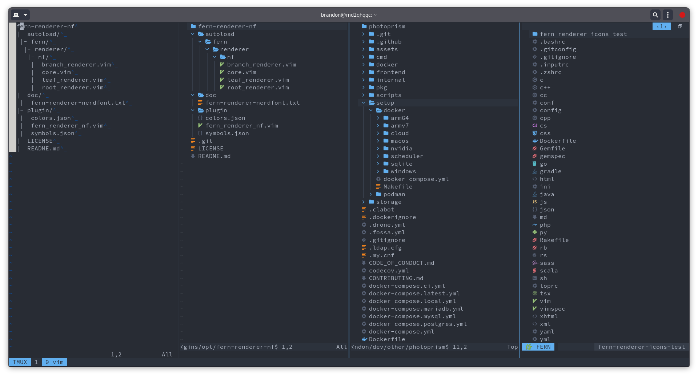

# fern-renderer-nf.vim

[](https://github.com/lambdalisue/fern.vim)

A beautiful and configurable renderer plugin for fern.



This plugin leverages new renderer capabilities that are only available in the
newest release of the Fern plugin. Consider updating Fern to the latest version.

This plugin is not supported in Neovim. If you would like to use this plugin in
Neovim, consider [implementing support for
extmarks](https://github.com/lambdalisue/fern.vim/pull/465) in Fern.

## Features

- file type icons ([Nerd Fonts](https://www.nerdfonts.com/))
- improved rendering of symbolic links and executables
- customizable file type icons and colors

## Installation

```
packadd! fern
packadd! fern-renderer-nf

let g:fern#renderer = 'brandon1024/fern-renderer-nf.vim'
```
